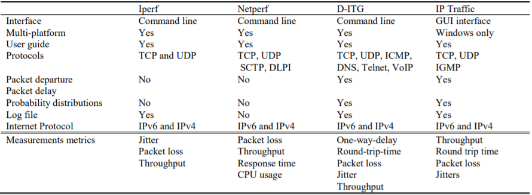
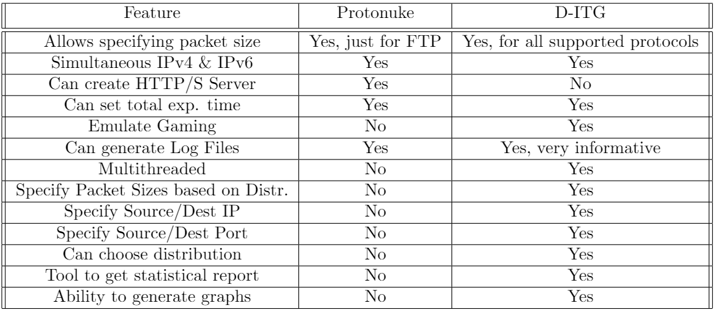
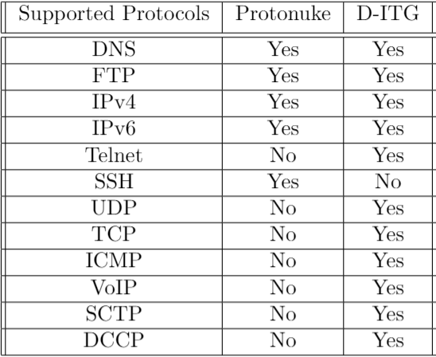
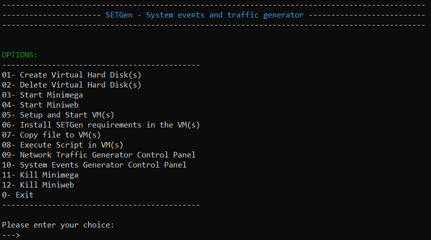
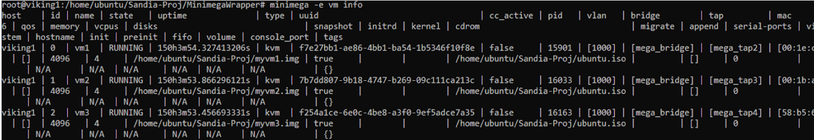
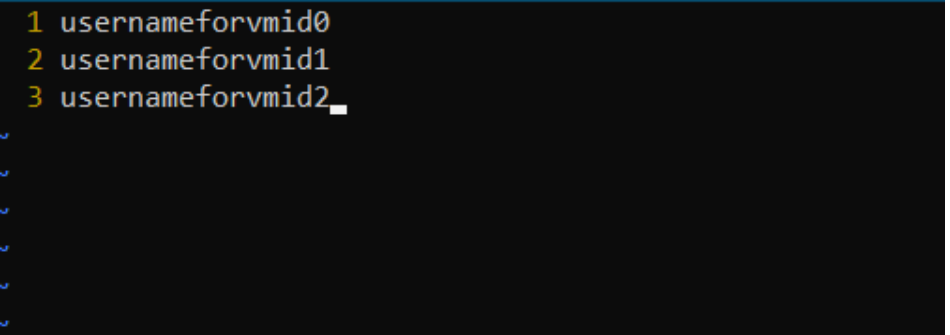
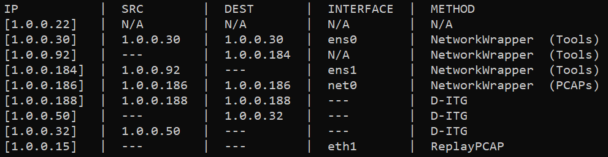
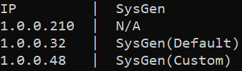

# SETGen Manual

### Last Updated: 15th August 2020

---

SETGen (System events and traffic generator) is an all-in-one script that provides the ability to control Minimega VMs, generate system events in VM(s), generate intra-VM/inter-VM network traffic, etc.

As of now, Ubuntu is the only supported operating system.

---
## Contributors:

**Prof. Berkay Celik**
 
Assistant Professor,
 
Dept. of Computer Science, Purdue University
 
 
**Basavesh Shivakumar**
 
Graduate Student,
 
Dept. of Computer Science, Purdue University
 
 
**Sidhartha Agrawal**
 
Undergraduate Student,
 
Dept. of Computer Science, Purdue University

---

## Pre-requisites

1. Minimega:

   Please ensure that Minimega is installed.

   To install Minimega, follow the instructions [here](https://ku.nz/miniclass/module1.html).

2) Miniweb:

   Please ensure that Miniweb is installed and the binaries are located in the /opt/bin directory.

   To install Miniweb, follow the instructions [here](https://ku.nz/miniclass/module1.html).

3.  Tmux:

    Tmux is a terminal multiplexer for Unix-like operating systems. It allows multiple terminal sessions to be accessed simultaneously in a single window. It is useful for running more than one command-line program at the same time.

    To install Tmux, run the following command:

         sudo apt install tmux

4)  SSHPass:

    SSHPass is a tiny utility, which allows you to provide the ssh password without using the prompt. This is very helpful for scripting.

    To install SSHPass, run the following command:

         sudo apt-get install sshpass

5.  D-ITG:

    D-ITG (Distributed Internet Traffic Generator) is a platform capable of producing IPv4 and IPv6 traffic by accurately replicating the workload of current Internet applications.

    To install D-ITG and its dependencies, run the following command:

         sudo apt-get install -y d-itg

6)  Root User Permissions

    In-order to use the Wrapper, root permissions are required.

    To login as the root user, run the following command:

        	    sudo su

---

## Installation

0.  **Make sure that the pre-requisites are installed**

1.  Unzip the installation file to the desired director

2.  Change directory to the MinimegaWrapper directory

3.  To change the permissions of the script, run

         chmod +x MinimegaWrapper.sh

4.  To change the permissions of all dependencies, run

         chmod +x scripts/*

5.  Kill all instances of Minimega and Miniweb processes

6.  With root user permissions, run

         ./MinimegaWrapper.sh

---

## Components of SETGen

1. **VHDCreator**
   
   This is a bash script that deals with automating creation and mounting of Virtual Hard Disks at a large scale. 
    
   The mount point is /mnt/.

2. **VHDDestoryer**
   
    This is a bash script that deals with automating removal and unmounting of Virtual Hard Disks at a large scale. 
   
3. **VMConnect**
   
   This is a bash script that deals with connecting with the running Minimega VM(s).
    
   This component mainly helps in copying file to VM(s), execute script in VM(s).

4. **VMgen**
   This is a bash script that automates the creation, running of Minimega VM(s).
    
   It also creates a DNS for VM(s) to be able to connect to the internet and interact with each other.

5. **WrapperInstaller**
   This is a bash script that installs all required tools, scripts and PCAPs for all the different kinds of network traffic generation using SETGen.
   
6. **D-ITG**
   D-ITG (Distributed Internet Traffic Generator) is a platform capable to produce traffic at packet level accurately replicating appropriate stochastic processes for both IDT (Inter Departure Time) and PS (Packet Size) random variables (exponential, uniform, cauchy, normal, pareto, etc.).

   - **ITGRecv**: It is the receiver component of D-ITG, which acts like a server and receives network traffic. The help file is located [here](ITGRecvHelp).
   - **ITGSend**: It is the sender component of D-ITG, which acts like a client and sends network traffic. The help file is located [here](ITGSendHelp).

   We had a couple of options to choose a traffic generator to integrate with SETGen. We referred to some resources and found that D-ITG was the most-configurable and had a fairly simple easy-to-understand documentation.

   
    
   Fig: D-ITG v/s Iperf v/s NetPerf v/s IP Traffic (Features)

    

   
    
   Fig: D-ITG v/s Protonuke (Features)

    
   
   
    
   Fig: D-ITG v/s Protonuke (Supported Protocols)

    

7. **NetworkWrapper**

   It is the component of SETGen that handles both Inter-VM and Intra-VM traffic generation.

8. **SysGen**

   It is the component of SETGen that handles system events generation for the VM(s).

## Notes

1. To avoid network traffic conflicts in Cross-VM Traffic Generation, SETGen allows only a unique pair of Host/Dest VM to generate traffic. So, if host **A** is generating traffic to host **B**, both **B and A can’t receive/send traffic from/to a different VM as long as A is generating traffic to B.**

2. It is strongly advised **NOT** to modify/create any files in tmp/ directory.

3. In the main menu, typing “clear” will clear the screen.
   
4. **Always** run SETGen script from its directory.
   
5. SETGen does **not** check for the validity of D-ITG related commands.

---

## Tutorial

1. Understanding SETGen main menu options

   
    
   Fig: SETGen main menu options

    

   **01- Create Virtual Hard Disk(s)**
    
   This option helps to create Virtual Hard Disk(s) using **VHDCreator**.
    
   The minimum recommended size for each Virtual Hard Disk is 30720 bytes i.e. 30gb.
    

   **02- Delete Virtual Hard Disk(s)**
    
   This option lets you delete Virtual Hard Disk(s) created using SETGen.
    
   **VHDDestroyer** is used here.
    

   **03- Start Minimega**
    
   This option starts a Minimega process using **tmux**.
    
   The session name for tmux is "Minimega".
    

   **04- Start Miniweb**
    
   This option starts a Miniweb process in background.
    

   **05-Setup and Start VM(s)**
    
   This option uses **VMgen** to create Minimega VM(s).
    
   It also provides internet access to the VM(s).
    

   **06- Install SETGen requirements in the VM(s)**
    
   This option uses **VMConnect** to connect to all running VMs and install all the required tools for SETGen.
    
   This option is also useful to update **NetworkWrapper** in all VM(s) to the latest release.
    

   **07- Copy file to VM(s)**
    
   This option uses **VMConnect** to copy file to a specific/all running VM(s).
    

   **08- Execute Script in VM(s)**
    
   This option uses **VMConnect** to execute a script in a specific/all running VM(s).
    

   **09- Network Traffic Generator Control Panel**
    
   This option controls intra-VM/inter-VM network traffic generation including viewing the status, starting/stopping traffic generation.
    
   There are 4 ways of generating network traffic:
    

   - Using **NetworkWrapper** with tools to generate/stop intra-VM/inter-VM network traffic:
       In this option, **NetworkWrapper** uses tools like protonuke, D-ITG, ping, etc. to generate random intra-VM/inter-VM network traffic based on the statistics gathered by analyzing real-world network traffic captures.
      

   - Using **NetworkWrapper** with PCAPs to generate/stop intra-VM network traffic:
       In this option, **NetworkWrapper** replays PCAP files in a randomized order. It follows the Weibul distribution, as analyzed by authors of the paper [Traffic analysis and characterization of Internet user behavior](https://portal.research.lu.se/portal/files/5436478/2027068.pdf), by replaying the PCAP files based on the probability and category.
      

   - Using **NetworkWrapper** to generate/stop intra-VM network traffic by replaying PCAP file:
       In this option, **NetworkWrapper** uses tcpreplay tool to generate intra-VM traffic by replaying a PCAP file (provided by the user) inside a VM.
      

   - Using **D-ITG** to generate/stop intra-VM/inter-VM network trafiic:
       In this option, **tmux** is used to create and run ITGSend (Network Traffic sender component of D-ITG) and ITGRecv (Network Traffic receiver component of D-ITG) inside/between VM(s)
      
    

   **10- System Events Generator Control Panel**
    
   This option controls system events generation inside VM(s) including viewing the status, starting/stopping event generation.
    

   The currently supported tasks are:
   - 1. Writing to a PPTX presentation file
   - 2. Writing to a text document file
   - 3. Writing to a word DOCX document
   - 4. Creating a PPTX presentation file
   

   There are 2 ways of generating system events:
    

   - Using **SysGen** with tools to generate/stop intra-VM/inter-VM network traffic:
       In this option, **NetworkWrapper** uses tools like protonuke, D-ITG, ping, etc. to generate random intra-VM/inter-VM network traffic based on the statistics gathered by analyzing real-world network traffic captures.
      

    

   **11- Kill Minimega**
    
    
   **WARNING: After using this option, it will be impossible to recover the current Minimega VM(s) and new VMs will have to be created!**
    
    
   This option will kill the **tmux** session "Minimega" created using SETGen option 3. 
    
   
   **12- Kill Miniweb**
    
   This option will kill the **Miniweb** process created using SETGen option 4.
    

   **13- Exit**
    
   This option quits SETGen script.
    
    
   **NOTE:** Quitting SETGen does **not** cause any damage to the running VMs.
    
    

2) Create Username and Password File for the VMs:

   To create username and password file for all VMs, run

   minimega -e vm info as the root user.

      
                    Fig: Sample output of Minimega VM info

    Then, create a file for username. Use a text editor (e.g. Vim) to edit the file.

    Type the username for each VM in order of Minimega ID (0,1,2, ……).

    For example, in the sample username file, the username in the first row is for vm1, second row for vm2 and third row for vm3.

      
                    Fig: Sample Username File

    In the similar way, create the password file containing the passwords for all VMs.

**Note:** Make sure to include username and password of all VMs, irrespective of their VM status. Also, make sure that both username and password file **don’t have a trailing new line at the end.**

3. Understanding VM Network Traffic Generation Status

     
   Fig: Sample Network Traffic Generation Status
    

   Here,

   **IP** column refers to the ip address of the VM.

   **SRC** column refers to the ip address of the source VM from which Network Traffic is being received.
   The possible values are **IP address**, **---**, and **N/A**.

   **DEST** column refers to the ip address of the destination VM to which Network Traffic is being sent.
   The possible values are **IP address**, **---**, and **N/A**.

   **INTERFACE** column refers to the network interface where network traffic is being generated.
   The possible values are **network interface(s) of the VM(s)**.

   **METHOD** column refers to the component being used for Network Traffic generation.  
   The possible values are: **NetworkWrapper (Tools)**, **NetworkWrapper (PCAPs)**, **D-ITG**, **ReplayPCAP**, and **N/A**.**

   The first row means that **1.0.0.22** is not generating any kind of traffic.

   The second row means that **1.0.0.30** is generating realistic traffic (using tools) within itself to the ens0 interface using the **Network Wrapper**.

   The third and fourth rows mean that **1.0.0.92** is generating realistic traffic (using tools) to 1.0.0.184’s ens1 interface using **the Network Wrapper**.

   The fifth row means that **1.0.0.186** is generating realistic traffic (using PCAPs) within itself to the net0 interface using the **Network Wrapper**.

   The sixth row means that **1.0.0.188** is generating traffic within itself using **D-ITG**.

   The seventh and eighth rows mean that **1.0.0.50** is generating D-ITG traffic to 1.0.0.32.

   The ninth row means that **1.0.0.15** is replaying a PCAP file in eth1 interface.

4. Understanding VM System Events Generation Status

     
   Fig: Sample System Events Generation Status
    
 
   **IP** column refers to the ip address of the VM.

   **SysGen** column refers to the method of SysGen being used (if any).
   The possible values are **SysGen(Default)**, **SysGen(Custom)**, and **N/A**

   The first row means that **1.0.0.210** is not generating any kind of System Events.

   The second row means that **1.0.0.32** is generating System Events with the **default** probability distribution using **SysGen**.

   The third row means that **1.0.0.48** is generating System Events with the **custom** probability distribution using **SysGen**.

 

5.  Manually installing required tools for SETGen in the VMs:

    After creating the VMs in Minimega using option 5, you are required to install ubuntu and manually install some tools in **all running VMs.**

    After logging in to the VM as the **root** user, update the system by running

         apt-get update

    Install python3 by running

         apt-get install python3

    Install OpenSSH Server by running

        apt install openssh-server

---

## Resources

Resources used to understand Applications of Protonuke
1. [protonuke as a Tool to Support Industrial Control Systems](https://www.osti.gov/servlets/purl/1507919)

Resources used to explore possible Network Traffic Generators and understand how they generate network traffic
1. [OpenAirInterface Traffic Generator (OTG): A Realistic Traffic Generation Tool for Emerging Application Scenarios](http://www.eurecom.fr/en/publication/3721/download/cm-publi-3721.pdf)
2. [Realistic and Responsive Network Traffic Generation](http://cseweb.ucsd.edu/~kvishwanath/papers/swing-sigcomm06.pdf)
3. [A tool for the generation of realistic network workload for emerging networking scenarios](http://wpage.unina.it/a.botta/pub/COMNET_WORKLOAD.pdf)
4. [D-ITG Distributed Internet Traffic Generator](https://www.researchgate.net/publication/221406698_D-ITG_Distributed_Internet_Traffic_Generator/link/09e41509ba1c1cf0d3000000/download)
5. [A Distributed Multiplatform Architecture For Traffic Generation](https://pdfs.semanticscholar.org/375e/2603833cf06e40708bfa04f151130326bae1.pdf)
6. [protonuke](https://minimega.org/articles/protonuke.article)
7. [Generating Realistic TCP Workloads](https://www.researchgate.net/profile/Kevin_Jeffay/publication/221447952_Generating_Realistic_TCP_Workloads/links/00b7d530cd8501d3e5000000.pdf)
8. [Harpoon: A Flow-Level Traffic Generator for Router and Network Tests](http://pages.cs.wisc.edu/~pb/harpoon_poster.pdf)
9. [Self-Configuring Network Traffic Generation](http://pages.cs.wisc.edu/~pb/selfconfig_final.pdf)
10. [TRex](https://trex-tgn.cisco.com/)
11. [Toward Comprehensive Traffic Generation for Online IDS Evaluation](http://pages.cs.wisc.edu/~pb/trident_final.pdf)
12. [LegoTG: Composable Traffic Generation with a Custom Blueprint](https://steel.isi.edu/Projects/legoTG/tr-699.pdf)
13. [Towards a Flexible and Extensible Framework for Realistic Traffic Generation on Emerging Networking Scenarios](https://pdfs.semanticscholar.org/0c25/504a9a78ceca227b95e775e3cf9735c83fec.pdf)
14. [Traffic flow (computer networking)](https://en.wikipedia.org/wiki/Traffic_flow_(computer_networking))

Resources used to Model the Network Traffic
1. [Traffic analysis and characterization of Internet user behavior](https://ieeexplore.ieee.org/document/5676633)
2. [On the Feasibility of Profiling Internet Users based on Volume and Time of Usage](https://www.csee.usf.edu/~sriramc/17_Latincom_SLC.pdf)

Resources used to get/capture Real-World Network Captures
1. [LBNL/ICSI Enterprise Tracing Project](http://www.icir.org/enterprise-tracing/)
2. [CSE-CIC-IDS2018 on AWS](https://www.unb.ca/cic/datasets/ids-2018.html)
3. [Chris Sanders PCAPs](https://github.com/chrissanders/packets/)
4. [Tcpreplay](https://tcpreplay.appneta.com/wiki/captures.html#smallflows-pcap)
5. [Aposemat IoT-23](https://www.stratosphereips.org/datasets-iot23)
6. [FIRMA: Malware Clustering and Network Signature Generation with Mixed Network Behaviors](https://software.imdea.org/~juanca/papers/firma_raid13.pdf)

Resources used to understand/model Benign User behaviour
1. [5 Levels of User Behavior Monitoring](https://www.ekransystem.com/en/blog/5-levels-user-behavior-monitoring)
2. [Data Gathering and User Behavior Analysis System](http://syrcose.ispras.ru/2007/files/2007_06_paper.pdf)
3. [LibreOffice - Source Code](https://www.libreoffice.org/about-us/source-code/)

